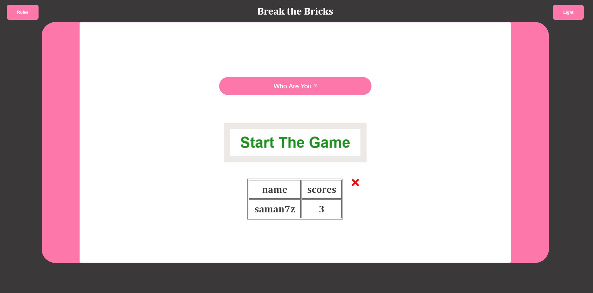

# Fun old Bricking Game :)
## I created this from scratch with vanilla Js

# Main Features :
- **theming choice** : You can choose between Light mode and Dark (default theme is my favourite) It's **Dark** :))
- **pure script** : meaning i didn't use any framework or library or anything like that just the good old js and css
- **slide menu** : That's the left top button that would show user the rules or whatever you want the user to know.
- **having memory of people who played it with their score** : data persists to the localStorage and get fetched on restart.

# Probable down sides: 
- It probably has a lot of bug, and i'm gonna fix them in near future.
- It's not fully optimized for smartphones (gonna make some time and make it work there)
- It may break in some old wierd browsers(i hope not)

